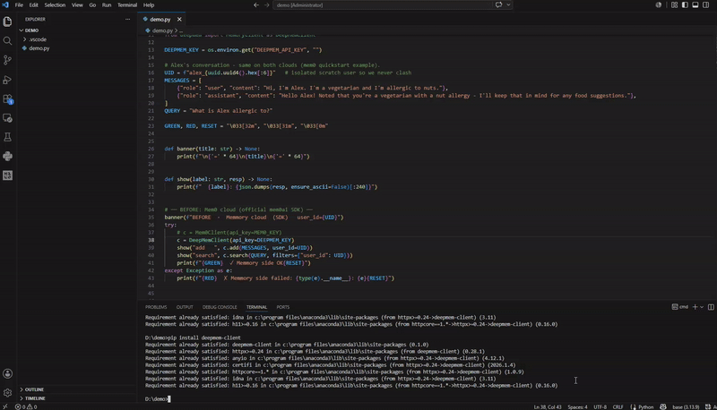

<p align="center">
  <h1 align="center">DeepMem</h1>
  <p align="center"><strong>Drop-in AI memory layer with 2× faster response and 10× lower cost.<br>
  Fully compatible with Mem0 API. Migrate in 5 minutes - one import line.</strong></p>
  <p align="center">Self-hostable. No auth, no payment, no lock-in. Or use the managed cloud at <a href="https://deepmem.dev">deepmem.dev</a>.</p>
</p>

<p align="center">
  <a href="https://hub.docker.com/r/langdeepmem/deepmem">
    
  </a>
  <a href="https://deepmem.dev">
    
  </a>
  <a href="LICENSE">
    
  </a>
</p>

<p align="center">
  <a href="https://deepmem.dev">Cloud</a>
  ·
  <a href="#quick-start">Self-host</a>
  ·
  <a href="#benchmarks">Benchmarks</a>
  ·
  <a href="benchmarks/README.md">Reproduce them</a>
</p>

<p align="center">
  
</p>

---

**Migrate from Mem0 in one line** - same `MemoryClient`, same method signatures:

```python
# Before - Mem0
from mem0 import MemoryClient
client = MemoryClient(api_key="m0-...")

# After - DeepMem (only the import changes)
from deepmem import MemoryClient
client = MemoryClient(api_key="dm_live-...")   # get a key at deepmem.dev
```

```bash
pip install deepmem-client
```

Turn conversations into searchable long-term memory: a FastAPI HTTP API in
front of a Qdrant vector store, with LLM fact extraction, hybrid retrieval
(vector + BM25 + entity boost + time-decay), semantic caching, async batched
distillation, GDPR controls, and a built-in MCP server. It runs in **open
mode** - no API key, no user registration - so you can deploy it for your own
agents in minutes. Multi-tenant isolation is driven by `user_id` in the
request body.

> **Prefer not to self-host?** **DeepMem Cloud** is the managed version of
> this exact engine at **[deepmem.dev](https://deepmem.dev)** - same API, no
> infra. Sign up, grab a key (`dm_live_...`), point your base URL at
> `https://deepmem.dev`, done. The cloud and the open-source server speak the
> same Mem0-compatible API, so client code is identical.

## Migrate from Mem0

Already using Mem0? Switch to DeepMem cloud in one line. The `deepmem-client`
package mirrors `mem0.MemoryClient` - same class name, same method signatures,
same `filters={"user_id": ...}` style - so everything after the import stays
untouched.

```bash
pip install deepmem-client
```

```python
# before (Mem0)
from mem0 import MemoryClient
client = MemoryClient(api_key="m0-...")
client.add(messages, user_id="alex")
client.search("What can Alex cook?", filters={"user_id": "alex"})

# after (DeepMem cloud) - change one import line
from deepmem import MemoryClient
client = MemoryClient(api_key="dm_live_...")        # key at https://deepmem.dev
client.add(messages, user_id="alex")                # identical calls
client.search("What can Alex cook?", filters={"user_id": "alex"})
```

<details><summary>Behavioral notes</summary>

- **`add(infer=True)` (the default) is asynchronous on DeepMem cloud** - it
  returns `pending=True` with `results=[]` and extracted facts land a few
  seconds later. (Mem0 cloud's `add` is async too - it returns `PENDING`.) Pass
  `infer=False` for synchronous raw-text storage that's immediately searchable.
- **No graph relations** - DeepMem uses hybrid vector retrieval (vector + BM25
  + time-decay), so `relations` is always `[]`. Mem0's graph features aren't
  replicated.
- **`reset` differs** - Mem0's is account-wide; DeepMem's is per-`user_id` with
  a confirm guard.

</details>

## Pricing

DeepMem Cloud is **10x cheaper than Mem0** at every paid tier - the same shape
of plans, a tenth of the price.

| Tier | DeepMem | Mem0 cloud |
|---|---|---|
| Hobby | Free | Free |
| Starter | **$1.9/mo** | $19/mo |
| Growth | **$7.9/mo** | $79/mo |
| Professional | **$24.9/mo** | $249/mo |

Self-host instead and it's **$0** - you pay only your own LLM/embedding
provider (the same LLM cost Mem0 charges on top of its plan price), with no
memory-service markup. Batched distillation also cuts LLM calls ~80%, so even
your provider bill is smaller than per-message extractors.

Plans and limits: [deepmem.dev](https://deepmem.dev) · [mem0.ai](https://mem0.ai/pricing).

## Benchmarks

No cherry-picked headline. The scripts and workload ship in
[`/benchmarks`](benchmarks/README.md) - run them yourself. Here's what we
measured and the exact config that produced it:

| Metric | DeepMem self-hosted ¹ | DeepMem cloud | Mem0 cloud |
|---|---|---|---|
| **Search p50** | **73 ms** | **643 ms** | 653 ms |
| **Search p95** | 86 ms | 811 ms | 710 ms |
| **Search hits** (40 queries) | - | **195** | 84 |
| **Add p50** (raw store) | 899 ms ² | 792 ms | 695 ms ³ |

> ¹ BGE-M3 on a GTX 1070 GPU (2016-era), local file Qdrant, `infer=False`,
> 100 ops, concurrency 1. ² Dominated by local-file Qdrant I/O - a Qdrant
> server cuts this sharply. ³ Mem0 has no raw-store mode; `add` always runs
> LLM extraction, so this row isn't apples-to-apples.

- **Self-hosted is where intrinsic latency lives** - no internet RTT, your
  embedder, your Qdrant. 73 ms p50 search on an old consumer GPU.
- **DeepMem cloud beats Mem0 cloud on search p50** (643 ms vs 653 ms) and
  returns **~2.3x more candidates per search** (195 vs 84 hits across 40
  queries).
- **Cloud latency is RTT-dominated** - both cloud columns were measured
  through a proxy from mainland China; run-to-run jitter is ~±10%. Run
  [`/benchmarks`](benchmarks/README.md) from a low-RTT location for your own
  numbers.

## Why DeepMem

Agent frameworks keep re-discovering that they need persistent, retrievable
memory. The hosted options bill per call and send your data to someone else's
cloud. DeepMem is the self-hostable alternative: the same Mem0-shaped API you
can drop in, but it runs on your box, with your embedder, your LLM key, and
your Qdrant - and the code is right here to verify it.


**How does DeepMem compare to other Mem0 alternatives?** Most are hosted-only or layer memory on top of someone else's vector DB. DeepMem combines three things at once: it's **self-hostable** (your data stays on your box - $0 beyond your own LLM key), **MCP-native** (Claude Desktop / Cursor read and write memories directly as tools), and **fully open-source** - and the managed cloud runs the exact same engine, so cloud and self-host are one API, not two products.

| Without DeepMem | With DeepMem |
|---|---|
| Re-explain who you are and what you're working on every session | The agent recalls identity, projects, and preferences automatically |
| Lose debugging and research context between sessions | Past root causes, dead ends, and findings are recalled, so work isn't repeated |
| Manually restate preferences every session | Preferences persist across sessions, agents, and projects |
| Hosted memory services that bill per call and hold your data | Self-host on your infra, or use the cloud - your call, same API |

### What it is (honestly)

- **Hybrid retrieval, not a knowledge graph.** Search fuses vector similarity,
  BM25 keyword match, entity boost, and time-decay scoring. There is no
  temporal graph layer; if that's what you need, look at Zep.
- **Stores preferences, not code dumps.** Large fenced code blocks are
  stripped before LLM extraction, so the store fills with durable
  user/project facts instead of pasted implementations.
- **BYOK, multi-provider.** Bring your own LLM (OpenAI / Anthropic / any
  OpenAI-compatible endpoint) and embedding (BGE-M3 / Google / OpenAI-compatible).
- **MCP-native.** Ships an MCP server so Claude Desktop / Cursor can read and
  write memories directly.

## Quick start

Three ways to run. All speak the same Mem0-compatible API.

### 1. Cloud (zero ops)

```bash
export DEEPMEM_API_KEY=dm_live_...      # from https://deepmem.dev
curl https://deepmem.dev/v1/memories \
  -H "Authorization: Bearer $DEEPMEM_API_KEY" -H "Content-Type: application/json" \
  -d '{"messages":[{"role":"user","content":"I am Pat, I live in Lisbon."}],"user_id":"pat","infer":false}'
curl https://deepmem.dev/v1/memories/search \
  -H "Authorization: Bearer $DEEPMEM_API_KEY" -H "Content-Type: application/json" \
  -d '{"query":"Where does Pat live?","user_id":"pat"}'
```

### 2. Docker (one command)

```bash
cp .env.example .env          # add an LLM key
docker compose up --build     # DeepMem (HTTP :8000 + MCP :8001) + Qdrant sidecar
curl http://localhost:8000/health
```

Or pull the published image:

```bash
docker pull langdeepmem/deepmem:latest
docker run -p 8000:8000 -p 8001:8001 -e DEEPSEEK_API_KEY=sk-... langdeepmem/deepmem:latest
```

The image exposes **`:8000` (HTTP)** and **`:8001` (MCP)**. The `Dockerfile`
and `docker-compose.yml` cover the GPU variant (CUDA torch + `BGE_DEVICE=cuda`)
and BGE-M3 model-download options (HF mirror, proxy, or local mount).

### 3. From source

```bash
git clone <repo> && cd mem
pip install -r requirements.txt
cp .env.example .env          # add an LLM key + embedder config
python server/start.py        # HTTP :8000 + MCP :8001
```

Write and search in three lines:

```python
import httpx
httpx.post("http://localhost:8000/v1/memories",
    json={"messages":[{"role":"user","content":"I'm Pat, I live in Lisbon."}],
          "user_id":"pat"})
print(httpx.post("http://localhost:8000/v1/memories/search",
    json={"query":"Where does Pat live?","user_id":"pat"}).json()["results"])
```

> `user_id` is optional (defaults to `"default"`); send different `user_id`s
> to isolate end-users. `infer: false` stores raw text immediately
> (test-friendly); the default `infer: true` queues for LLM fact extraction.

## Feature highlights

**Multi-provider by config, not code.** Both layers switch on env vars:

| Layer | Options | Selector |
|---|---|---|
| **LLM** (fact extraction) | OpenAI · Anthropic (native SDK) · any OpenAI-compatible (DeepSeek / vLLM / Ollama / Groq / LM Studio) | `LLM_PROVIDER` + `LLM_API_KEY` / `ANTHROPIC_API_KEY` / `DEEPSEEK_API_KEY` |
| **Embeddings** | BGE-M3 (local, GPU/CPU) · Google Gemini · any OpenAI-compatible | `EMBEDDING_PROVIDER` + `BGE_M3_PATH` / `GOOGLE_API_KEY` / `OPENAI_API_KEY` |

`BGE_DEVICE=auto|cpu|cuda` picks GPU when available, else CPU (force `cpu`
on small-VRAM cards to avoid multi-process contention). BYOK overrides the
LLM per-request.

**Hybrid retrieval.** Vector similarity + BM25 keyword + entity boost +
time-decay, fused into one score. Over-fetch, re-rank, return.

**Async batched distillation.** Writes queue behind a silence window and are
extracted in batches - ~80% fewer LLM calls than per-message extraction.

**Semantic cache.** Repeat adds/searches hit a similarity-gated cache and
return cached facts without re-embedding or re-querying Qdrant.

**Stores preferences, not code.** `extraction_filter` strips large fenced
code blocks before LLM extraction, so the store fills with durable facts,
not pasted implementations.

**MCP server.** `deepmem_write` / `deepmem_search` / `deepmem_delete` tools
for Claude Desktop, Cursor, and any MCP client.

**GDPR.** Soft-delete with retention window, hard-delete `reset`, SHA-256
id masking in logs, export/import for portability.

## API

| Method | Path | Description |
|--------|------|-------------|
| POST | `/v1/memories` | Write messages; LLM-extract facts (`infer=false` stores raw) |
| POST | `/v1/memories/search` | Semantic search (vector + BM25 + entity + time-decay) |
| GET | `/v1/memories` | List all for a `user_id` (paginated) |
| GET | `/v1/memories/{id}` | Get one by ID |
| PUT | `/v1/memories/{id}` | Update one memory's text |
| DELETE | `/v1/memories/{id}` | Soft-delete one |
| DELETE | `/v1/memories` | Soft-delete all for a `user_id` (GDPR) |
| GET | `/v1/memories/{id}/history` | ADD/UPDATE/DELETE audit log |
| POST | `/v1/reset` | Hard-delete all + history (needs `confirm_user_id`) |
| GET | `/v1/export` · POST `/v1/import` | Portable JSON export / import |
| GET | `/health` · `/ready` | Liveness / readiness probes |

`agent_id` / `run_id` optionally scope writes/reads (mirrors Mem0's three-level
isolation: user -> agent -> run). Interactive docs at `/docs`.

### MCP integration

```json
{
  "mcpServers": {
    "deepmem": {
      "command": "python",
      "args": ["server/mcp_server.py"],
      "env": { "DEEPMEMORY_BASE_URL": "http://localhost:8000" }
    }
  }
}
```

Open mode needs no API key - `DEEPMEMORY_API_KEY` stays empty.

## Architecture

```
client (HTTP / MCP)
  -> FastAPI (:8000)
       -> rate-limit middleware (per-IP token bucket on add/search)
       -> SemanticCache.check            (return cached facts on similarity hit)
       -> AsyncBatchDistiller.enqueue    (POST /v1/memories, infer=true)
            ↳ silence-window or max_batch triggers on_batch_ready
                ↳ VectorStore.process_batch  (LLM extraction -> Qdrant upsert)
       -> VectorStore.search             (vector + BM25 + entity + time-decay)
  -> LLM: OpenAI / Anthropic / OpenAI-compatible (fact extraction)
  -> BGE-M3 / Gemini / OpenAI-compatible (embeddings)
  -> Qdrant (vectors)  +  SQLite (audit history)
  -> MCP server (:8001)  deepmem_write / deepmem_search / deepmem_delete
```

Single Qdrant collection (`memories`), hard-filtered by `user_id` payload.
`TenantValidator` NFC-normalizes and enforces a `[A-Za-z0-9._:-]{1,256}`
charset on `user_id` - never trust the raw request value.

## Configuration

Config loads once from env vars (`.env`, auto-loaded) > `config.json` > defaults.
Key variables:

| Variable | Required | Description |
|----------|----------|-------------|
| `DEEPSEEK_API_KEY` / `LLM_API_KEY` / `ANTHROPIC_API_KEY` | one LLM key | LLM for fact extraction |
| `LLM_PROVIDER` | no | `auto` / `openai` / `anthropic` / `openai_compatible` (default `auto`) |
| `EMBEDDING_PROVIDER` | no | `bge-m3` / `google` / `openai` (default `bge-m3`) |
| `BGE_M3_PATH` | no | local BGE-M3 dir or HF model id (default `BAAI/bge-m3`) |
| `BGE_DEVICE` | no | `auto` / `cpu` / `cuda` (default `auto`) |
| `QDRANT_URL` / `QDRANT_API_KEY` | no | remote Qdrant; omit for local file store |
| `CORS_ORIGINS` | yes | comma-separated allowed origins (no `*` in prod) |
| `RATE_LIMIT_ADD` / `RATE_LIMIT_SEARCH` | no | per-minute limits (default 30 / 60) |

Backends auto-switch on env vars - no code changes:
- `QDRANT_URL` set -> remote Qdrant; unset -> local file Qdrant under `./data/qdrant`.
- `CORS_ORIGINS=*` is refused at boot unless `DEEPMEMORY_DEBUG=1`.

### Production (systemd)

```bash
systemctl restart deepmem.service     # scripts/start.sh -> uvicorn :8000
journalctl -u deepmem -f
```

For HTTPS, put Caddy or Nginx in front; `scripts/start.sh` runs under systemd
or any process manager.

## Benchmarks

Two reproducible scripts in [`/benchmarks`](benchmarks/README.md):

- **Cloud vs cloud** - DeepMem cloud vs Mem0 cloud. Register keys at
  [deepmem.dev](https://deepmem.dev) + [mem0.ai](https://mem0.ai), then
  `python benchmarks/benchmark_cloud.py`.
- **Self-hosted** - your DeepMem, your hardware (no key, no external service):
  `python benchmarks/run_benchmark.py`.

Both ship a self-contained workload and report P50/P95/P99 + throughput. The
numbers at the top of this README were produced with these scripts - rerun
them and read your own percentiles.

## FAQ

**Do I need the cloud?** No. The open-source server is fully functional on its
own. The cloud ([deepmem.dev](https://deepmem.dev)) is the zero-ops option -
same API.

**Does it work offline?** Retrieval and raw-store (`infer=false`) work with no
network. LLM fact extraction (`infer=true`) needs an LLM key - or run a local
OpenAI-compatible model (Ollama / vLLM / LM Studio) and point `LLM_BASE_URL`
at it.

**Where is my data?** In your Qdrant (local file or server) + a SQLite audit
log. Nothing leaves your machine except the LLM/embedding calls you configure.

**Multi-tenant?** Yes - single Qdrant collection hard-filtered by `user_id`.
`agent_id` / `run_id` add agent and session scope.

**Is it production-ready?** Used in production under systemd with a remote
Qdrant. Local file Qdrant is fine for dev/single-worker; use a Qdrant server
for multi-worker or high-throughput.

## Development

```bash
pip install -r requirements.txt
DEEPMEMORY_DEBUG=1 python -m uvicorn server.main:app --reload --host 0.0.0.0 --port 8000
pytest tests/ -x -v
```

## License

[MIT](LICENSE).
